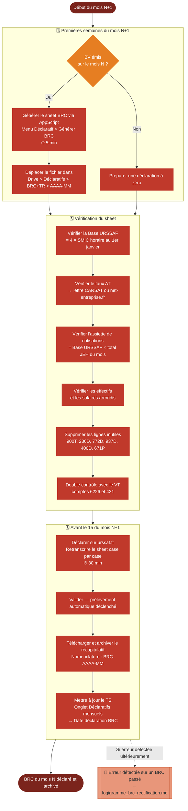

# Logigramme — Déclaration BRC

> Fiche associée : [brc.md](../brc.md)

## ⚠️ Points sensibles

- Respecter l'échéance du 15 du mois — un retard entraîne des pénalités URSSAF
- Vérifier la Base URSSAF chaque 1er janvier — elle change avec le SMIC, une mauvaise base fausse tous les calculs de l'année
- Même sans BV sur le mois, la déclaration est obligatoire (déclaration à zéro)
- Arrondir les salaires à l'unité — jamais de centimes dans un BRC
- Supprimer les lignes inutiles (772D, 937D, 671P...) — elles ne s'appliquent pas aux JE

## ❓ Précisions

- L'assiette de cotisations des JE est dérogatoire : Base URSSAF × nombre de JEH, pas les rétributions brutes réelles
- Effectif au dernier jour : 0 si aucun BV, 1 sinon (quel que soit le nombre d'intervenants)
- Effectif rétribué : nombre d'intervenants différents ayant reçu au moins un BV sur le mois
- La colonne "Effectifs" est toujours à 0 — les intervenants JE ne sont pas des salariés
