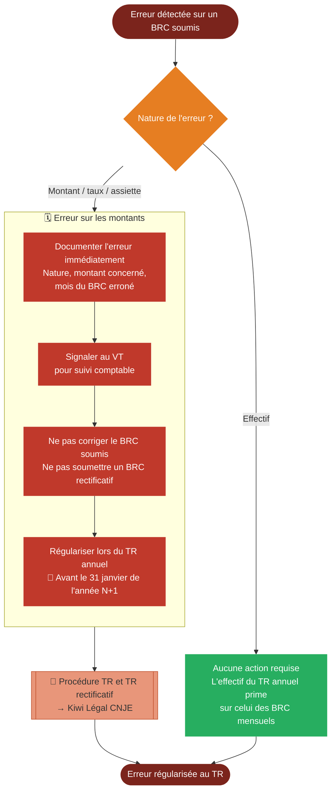

# Logigramme — Rectification d'un BRC

> Fiche associée : [brc_rectification.md](../brc_rectification.md)

## ⚠️ Points sensibles

- Ne pas tenter de corriger un BRC déjà soumis — il n'existe pas de BRC rectificatif, toute régularisation passe par le TR
- Documenter l'erreur immédiatement — plus le délai est long entre la détection et le TR, plus il est difficile de justifier l'écart auprès de l'URSSAF
- L'effectif du TR prime sur celui des BRC mensuels — une erreur d'effectif sur un BRC n'a pas besoin d'être régularisée

## ❓ Précisions

- Pour les procédures TR et TR rectificatif, consulter le [tutoriel CNJE sur Kiwi Légal](https://legal.junior-entreprises.com/knowledge-base/tableau-recapitulatif-tr/)
