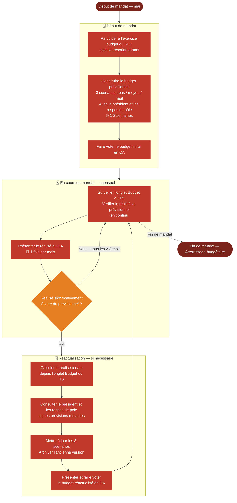

# Logigramme — Suivi et réactualisation du budget

> Fiche associée : [budget.md](../budget.md)

## ⚠️ Points sensibles

- Budget en HT — ne jamais saisir du TTC
- Archiver chaque version réactualisée pour garder l'historique des décisions
- Impliquer les respos de pôle — un budget sans eux sera contesté ou ignoré
- Ne pas attendre une dérive importante pour réactualiser
- Le résultat visé est une contrainte sauf décision explicite du CA de le réviser

## ❓ Précisions

- Le réalisé se met à jour automatiquement dans l'onglet Budget du TS
- Les prévisions restent à réviser manuellement lors des réactualisations
- Impliquer le trésorier entrant ET sortant lors de la construction initiale (retours sur les enjeux budgétaires de chaque pôle)
