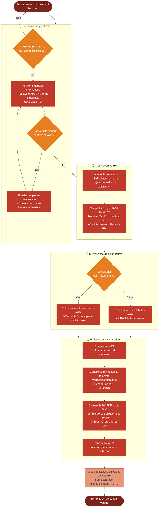

# Logigramme — Emission des bulletins de versement (BV)

> Fiche associée : [bulletins_de_versement.md](../bulletins_de_versement.md)

## ⚠️ Points sensibles

- Ne jamais émettre un BV avant l'encaissement client — même si le PVRF est signé depuis longtemps, le BV attend le virement
- Le BV est un document RGPD — ne jamais le transmettre à quelqu'un d'autre que l'intervenant, même au chef de projet
- La numérotation XXX repart au 1er janvier, pas au 1er mai comme les factures
- Si le trésorier est intervenant : ne pas gérer son propre BV, passer la main au VT pour l'émission et au président pour le virement
- Les charges sociales ne sont pas virées à l'intervenant — elles sont calculées dans le TS et payées à l'URSSAF via le BRC mensuel

## ❓ Précisions

- Le modèle de BV est fourni chaque année par la CNJE (nouveau modèle avec taux à jour) — ne pas réutiliser un ancien modèle
- Vérifier chaque 1er janvier que la Base URSSAF (4 × SMIC horaire) et le taux AT sont à jour dans l'onglet Paramétrage du TS
- Un intervenant avec plusieurs BV sur la même étude : incrémenter le N dans la nomenclature BV-XXX-CODE_ETUDE-N
