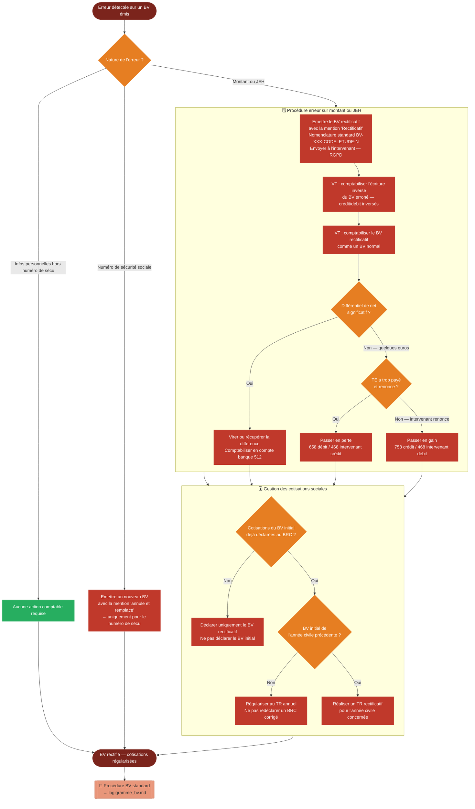

# Logigramme — Rectification d'un bulletin de versement

> Fiche associée : [bv_rectificatif.md](../bv_rectificatif.md)

## ⚠️ Points sensibles

- Bien identifier la nature de l'erreur avant d'agir — une erreur sur les infos personnelles (hors numéro de sécu) ne nécessite aucune action comptable
- Le BV rectificatif porte la mention "Rectificatif", pas "annule et remplace" — cette mention est réservée aux erreurs sur le numéro de sécurité sociale
- Ne pas déclarer le BV rectificatif au BRC si le BV initial a déjà été déclaré — la régularisation se fait au TR
- Si le BV initial date de l'année civile précédente, un TR rectificatif est indispensable — ne pas l'ignorer
- Documenter le lien entre le BV erroné et le BV rectificatif dans le TS pour que le VT puisse reconstituer l'historique

## ❓ Précisions

- Les petits différentiels peuvent être passés en perte (658) ou en gain (758), mais cette décision doit être explicite et documentée
- Pour les procédures TR et TR rectificatif, consulter le [tutoriel CNJE sur Kiwi Légal](https://legal.junior-entreprises.com/knowledge-base/tableau-recapitulatif-tr/)
