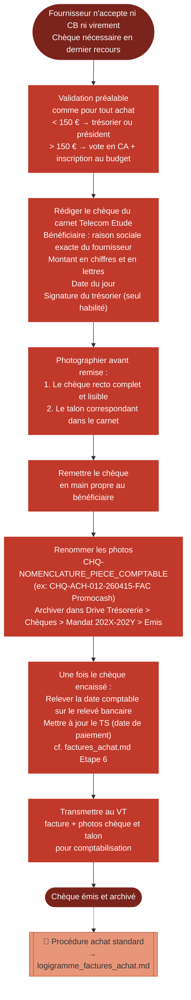

# Logigramme — Emission d'un chèque

> Fiche associée : [cheque_emission.md](../cheque_emission.md)

## ⚠️ Points sensibles

- Le chèque est un moyen de paiement de dernier recours — toujours privilégier la carte bancaire ou le virement
- Seul le trésorier peut signer — aucun autre membre n'est habilité à signer un chèque de Telecom Etude
- Photographier avant de remettre — une fois le chèque donné, il n'est plus disponible pour archivage
- Photographier aussi le talon — c'est la seule trace physique restante une fois le chèque remis

## ❓ Précisions

- La date à saisir dans le TS est la date comptable du relevé bancaire, pas la date d'émission ni de remise
- La nomenclature du fichier archive reprend la nomenclature de la facture d'achat associée (ACH-XXX...)
