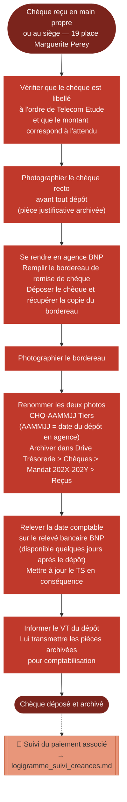

# Logigramme — Réception d'un chèque

> Fiche associée : [cheque_reception.md](../cheque_reception.md)

## ⚠️ Points sensibles

- Photographier le chèque avant de le déposer — une fois remis en agence, il n'est plus récupérable
- Vérifier que le chèque est libellé à l'ordre de Telecom Etude — un chèque à un autre nom ne peut pas être déposé
- La date à saisir dans le TS est la date comptable du relevé bancaire, pas la date de réception ni la date de dépôt

## ❓ Précisions

- La date comptable est disponible dans l'interface BNP quelques jours après le dépôt en agence
- La nomenclature CHQ-AAMMJJ Tiers s'applique aux deux photos (chèque et bordereau)
- Les chèques sont rares à Telecom Etude — en cas de doute sur la procédure, consulter le VT
