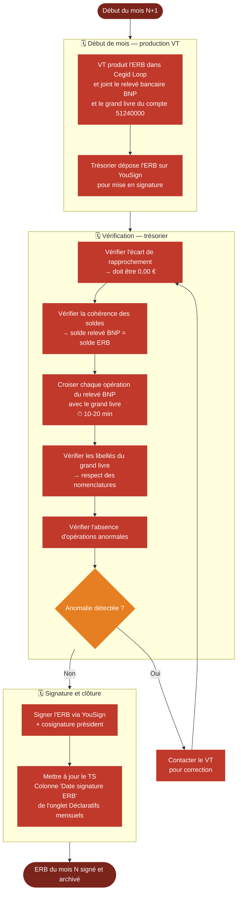

# Logigramme — Signature de l'ERB

> Fiche associée : [erb.md](../erb.md)

## ⚠️ Points sensibles

- Ne jamais signer si l'écart de rapprochement n'est pas à 0,00 € — même un faible écart signifie une opération manquante ou incorrecte
- Le contrôle n'est pas une formalité — le trésorier engage sa responsabilité en cosignant
- L'ERB porte sur le mois N-1 — ne pas confondre les périodes
- Vérifier les soldes de départ : le solde initial du grand livre doit correspondre au solde final de l'ERB du mois précédent

## ❓ Précisions

- L'ERB se compose de 3 parties : l'ERB Loop, le relevé BNP, le grand livre du compte 51240000
- Exemples de correspondances attendues : un virement FAC-XXX dans le relevé doit apparaître avec la même référence et le même montant dans le grand livre ; un prélèvement URSSAF doit correspondre à une écriture "URSSAF Mois AAAA" ; un paiement CB Mailchimp doit correspondre à une écriture ACH-XXX-Mailchimp
