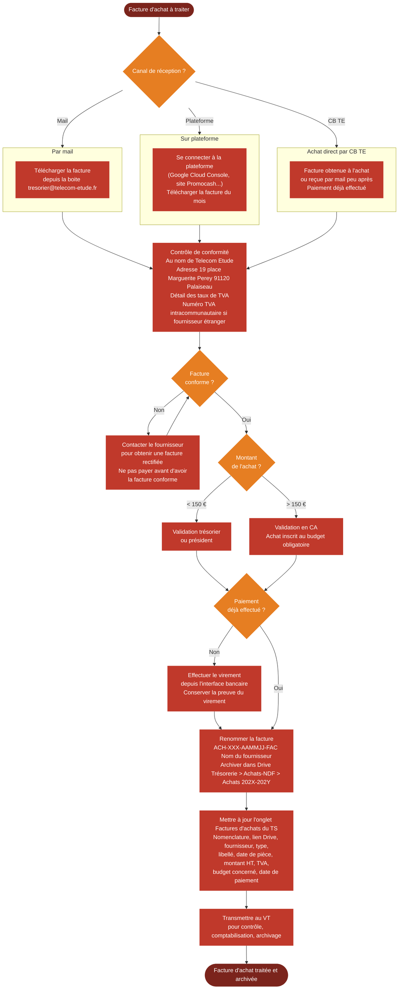

# Logigramme — Réception et traitement des factures d'achat

> Fiche associée : [factures_achat.md](../factures_achat.md)

## ⚠️ Points sensibles

- Seul le trésorier est autorisé à utiliser la carte bancaire TE — si un membre souhaite faire un achat, il doit passer par le trésorier
- Bon de livraison ≠ facture — chez Promocash notamment, le document remis en magasin n'est pas une facture, toujours aller chercher la vraie facture sur le site
- Ne pas payer une facture non conforme — demander une facture rectifiée même si cela prend du temps
- Surveiller les montants des prélèvements automatiques — un changement de tarif peut passer inaperçu

## ❓ Précisions

- La date à retenir est la date d'émission de la facture (inscrite sur la facture), pas la date de réception ni de paiement
- Pour les prélèvements automatiques récurrents déjà inscrits au budget (Cegid, Google), la validation a eu lieu lors de l'adoption du budget — vérifier seulement que le montant prélevé correspond à l'attendu
- Traiter chaque facture dès réception pour éviter les retards de comptabilisation
