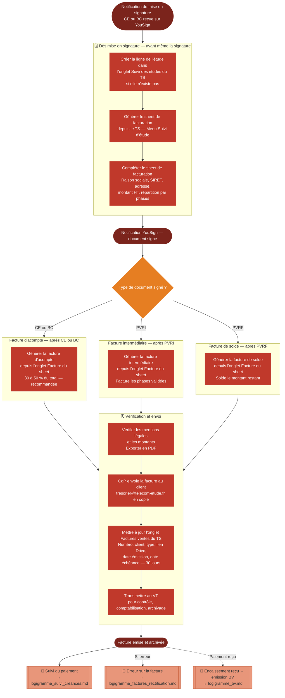

# Logigramme — Emission de factures clients

> Fiche associée : [factures_clients.md](../factures_clients.md)

## ⚠️ Points sensibles

- Ne pas émettre une facture avant que tous les signataires aient signé le document déclencheur
- Remplir le sheet de facturation dès la mise en signature de la CE — ne pas attendre la signature effective
- Mettre à jour le sheet à chaque avenant, même si seule la nomenclature change
- Vérifier le SIRET — une facture avec un SIRET erroné est non conforme
- Toujours être en copie de l'envoi pour assurer le suivi de réception

## ❓ Précisions

- La facture d'acompte ne permet pas de rétribuer un intervenant — attendre la facture intermédiaire ou de solde
- Délai de paiement : 30 jours date de facture pour les clients standard (vérifier les conditions générales en cas de doute)
- TVA toujours à 20 % pour les clients français, sans exception
- Pour les avoirs et les factures clients étrangers : ne pas improviser, consulter Kiwi Légal ou la CNJE
