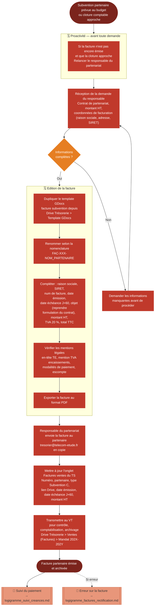

# Logigramme — Emission de factures partenaires

> Fiche associée : [factures_partenaires.md](../factures_partenaires.md)

## ⚠️ Points sensibles

- Ne pas attendre que le responsable du partenariat prenne l'initiative — si la cloture approche, relancer proactivement
- Toujours vérifier les coordonnées du partenaire, même pour les partenaires récurrents (elles peuvent changer d'une année sur l'autre)
- Le délai de paiement est de 60 jours, pas 30 — ne pas paramétrer la mauvaise date d'échéance
- Ne pas oublier la TVA à 20 % — les subventions partenaires sont des prestations commerciales, pas des dons
- Toujours être en copie de l'envoi pour assurer le suivi de réception

## ❓ Précisions

- La numérotation globale est partagée avec les factures d'étude — ne pas réinitialiser le compteur
- Pour BearingPoint, l'adresse d'envoi spécifique est supplierinvoice@bearingpoint.com
- En cas d'erreur sur une facture déjà émise, suivre la procédure de rectification dédiée
