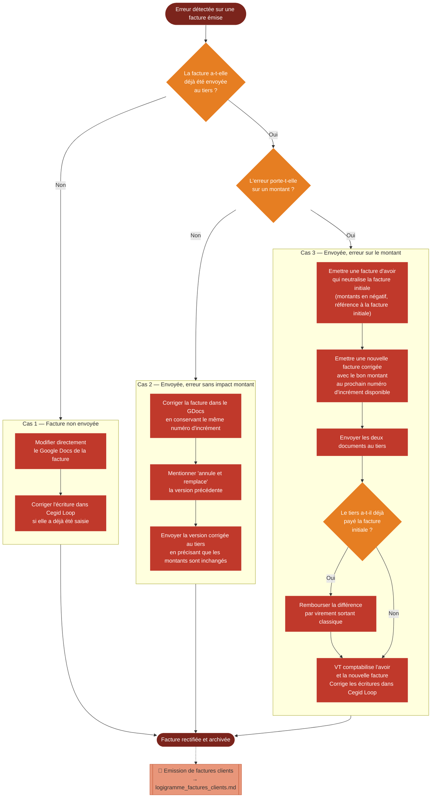

# Logigramme — Rectification d'une facture émise

> Fiche associée : [factures_rectification.md](../factures_rectification.md)

## ⚠️ Points sensibles

- Ne jamais supprimer une facture envoyée — une fois transmise au tiers, elle doit être neutralisée par un avoir, jamais effacée
- Une erreur dans le BC ou la CE ne se corrige pas par un avoir — le contrat signé fait foi, c'est un sujet juridique à traiter avec le VPO ou le CdP
- Après signature du PVRF, un avoir ne modifie pas les JEH — il ne porte que sur les montants en euros de la facture

## ❓ Précisions

- La facture d'avoir doit comporter : le terme "avoir" dans le titre, la référence à la facture initiale, la mention "net à déduire" au lieu de "net à payer", les montants en négatif, et les modalités de remboursement si applicable
- La nomenclature de l'avoir suit le format standard avec le prochain numéro d'incrément disponible
- Pour plus de détails, consulter le tutoriel CNJE sur Kiwi Légal : Rectification de facture
