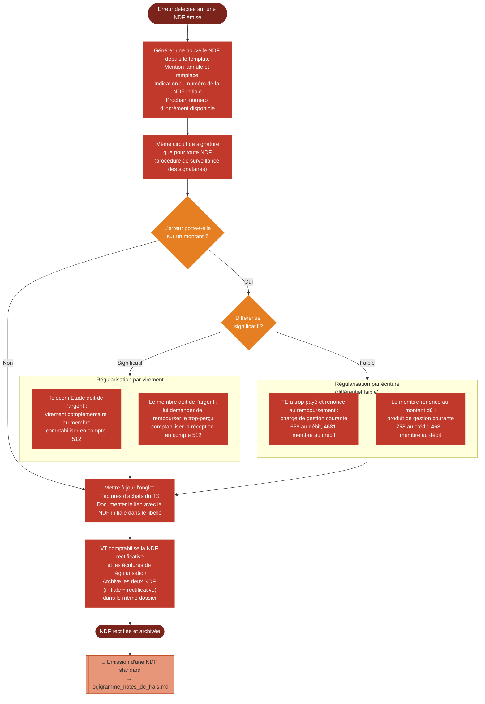

# Logigramme — Rectification d'une note de frais

> Fiche associée : [ndf_rectificative.md](../ndf_rectificative.md)

## ⚠️ Points sensibles

- "Annule et remplace" couvre tous les types d'erreurs — il n'y a pas de distinction de procédure selon la nature de l'erreur
- Les mêmes règles de surveillance des signataires s'appliquent à la NDF rectificative qu'à la NDF initiale
- Ne pas oublier de virer ou récupérer la différence si l'erreur porte sur un montant — même petite, elle doit être traitée explicitement
- Archiver les deux NDF ensemble pour que le VT puisse reconstituer l'historique

## ❓ Précisions

- Le compte du membre est le 4681, à ne pas confondre avec le 468 utilisé pour les intervenants (BV)
- La NDF rectificative prend le prochain numéro d'incrément disponible, pas le même numéro que la NDF initiale
