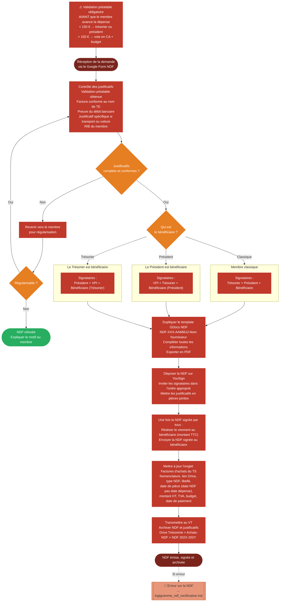

# Logigramme — Notes de frais (NDF)

> Fiche associée : [notes_de_frais.md](../notes_de_frais.md)

## ⚠️ Points sensibles

- Toujours valider avant l'avance — une dépense engagée sans validation préalable peut légitimement être refusée
- Ne jamais rembourser sans NDF signée — le virement intervient après la signature complète, pas avant
- Surveiller les signataires — appliquer scrupuleusement la procédure de surveillance dès que le bénéficiaire est président ou trésorier
- Pas de ticket de caisse sauf exception restaurant < 150 €

## ❓ Précisions

- La date de pièce dans le TS est la date de la NDF, pas la date de la dépense
- Si le trésorier est bénéficiaire, c'est le président qui réalise le virement
- Détailler l'objet de la NDF pour montrer le lien avec l'objet social de la JE
- La TVA est déductible uniquement si la facture est au nom de Telecom Etude avec le détail des taux
