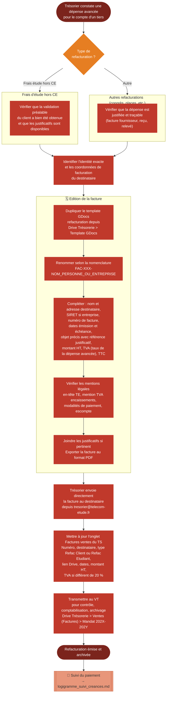

# Logigramme — Refacturation

> Fiche associée : [refacturation.md](../refacturation.md)

## ⚠️ Points sensibles

- Pour les frais d'étude hors CE, ne jamais refacturer sans validation préalable écrite du client — la base légale est dans les conditions générales d'étude
- La TVA est au taux de la dépense avancée, pas nécessairement 20 % — vérifier le justificatif
- Ne pas oublier de facturer — surveiller activement les dépenses avancées pour ne pas laisser passer une refacturation
- Toujours conserver les justificatifs de la dépense avancée en cas de contrôle ou de contestation

## ❓ Précisions

- C'est le trésorier qui envoie directement la facture (contrairement aux factures d'étude envoyées par le CdP)
- Si le destinataire est un particulier, il ne pourra pas déduire la TVA, mais celle-ci reste obligatoire
- La numérotation globale est partagée avec toutes les autres factures
