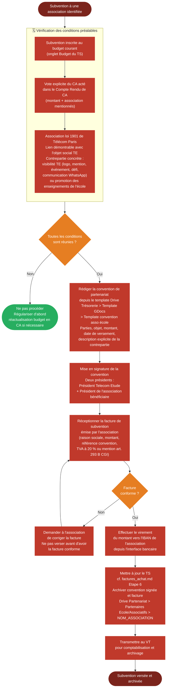

# Logigramme — Versement d'une subvention à une association

> Fiche associée : [subvention_asso.md](../subvention_asso.md)

## ⚠️ Points sensibles

- Pas de versement sans vote CA explicite — une décision informelle (message, mail) ne suffit pas
- Pas de versement hors budget — si la subvention n'était pas prévue, faire d'abord une réactualisation budgétaire votée en CA
- Vérifier le lien avec l'objet social — la contrepartie doit être concrète et formulée clairement dans la convention
- La facture de l'asso est obligatoire — ne pas verser sur simple demande ou convention seule
- La convention doit précéder le versement — ne pas payer avant que les deux présidents aient signé

## ❓ Précisions

- La plupart des assos étudiantes ne sont pas assujetties à la TVA mais doivent le mentionner explicitement (art. 293 B CGI)
- Une subvention sans contrepartie claire et rattachable à l'objet social expose Telecom Etude à un risque de requalification fiscale
- Pour aller plus loin sur le cadre légal, consulter Kiwi Légal : kiwi légal — verser une subvention
