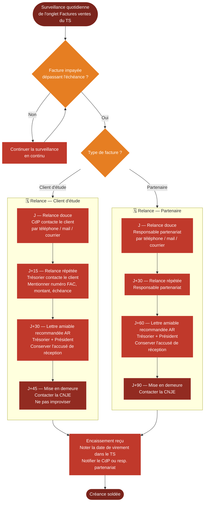

# Logigramme — Suivi des créances et procédure de relance

> Fiche associée : [suivi_creances.md](../suivi_creances.md)

## ⚠️ Points sensibles

- C'est le trésorier qui pilote — ne pas attendre que le CdP signale un retard
- Conserver tous les accusés de réception des lettres recommandées, indispensables en cas de contentieux
- Ne pas dépasser J+45 sans contacter la CNJE pour les clients
- Pour une facture État : ne pas décompter en jours, attendre la fin de procédure sur Chorus Pro

## ❓ Précisions

- Délais de paiement : 30 jours pour les clients d'études, 60 jours pour les partenaires — les délais de relance se calculent depuis l'échéance réelle, pas depuis la date d'émission
- Les deux premières relances partenaires sont portées par le responsable partenariat qui entretient la relation commerciale — le trésorier entre en jeu à partir de J+60
- Présenter les créances en cours au CA pour informer les membres
