# Logigramme — Déclaration de TVA

> Fiche associée : [tva.md](../tva.md)

```mermaid
flowchart TD
    classDef step fill:#c0392b,color:#fff,stroke:none
    classDef dec fill:#e67e22,color:#fff,stroke:none
    classDef se fill:#7b241c,color:#fff,stroke:none
    classDef warn fill:#922b21,color:#fff,stroke:none
    classDef ref fill:#e8967a,color:#333,stroke:#c0502b

    START([Début du mois N+1]):::se

    subgraph GEN["🗓 Génération — premières semaines du mois N+1"]
        direction TB
        G1["Générer le sheet TVA via AppScript\nMenu Déclaratif > Générer TVA pour un mois\n⏱ 5 min"]:::step
        G2["Déplacer le fichier dans\nDrive > Déclaratifs > TVA > Mandat > AAAA-MM"]:::step
        G1 --> G2
    end

    subgraph CTRL["🗓 Vérification du sheet"]
        direction TB
        C1["Case 01 — Croiser avec les encaissements\ndu relevé bancaire du mois\n→ tous les virements clients et partenaires en HT"]:::step
        C2["Case 20 — Croiser avec la TVA des factures d'achat\ndu mois → vérifier les cas de non-déductibilité\ntransports, hébergements, alcool..."]:::step
        C3{"Crédit de TVA\ndu mois précédent ?"}:::dec
        C4["Reporter le crédit en case 25"]:::step
        C5["Vérifier la cohérence de la case 28\nTVA collectée - TVA déductible - crédit"]:::step
        C6["Double contrôle avec le VT\nComptes 44571, 44577, 44566, 44567"]:::step
        C1 --> C2 --> C3
        C3 -->|Oui| C4 --> C5
        C3 -->|Non| C5
        C5 --> C6
    end

    subgraph DECL["🗓 Avant le 24 du mois N+1"]
        direction TB
        D1["Déclarer sur impots.gouv.fr\nRetranscrire case par case\n⏱ 15-30 min"]:::step
        D2["Télécharger et archiver la déclaration\nNomenclature : TVA MM-AAAA"]:::step
        D3["Télécharger et archiver l'accusé de réception\nNomenclature : Accuse TVA MM-AAAA"]:::step
        D1 --> D2 --> D3
    end

    PAY["⚠️ Cliquer sur le bouton 'Payer'\nSans ce clic la TVA n'est pas prélevée\n⏱ 1 min"]:::warn
    ARCH["Télécharger et archiver le justificatif de paiement\nNomenclature : Paiement TVA MM-AAAA"]:::step
    TS["Mettre à jour le TS\nOnglet Déclaratifs mensuels\n→ Date déclaration TVA"]:::step

    CREDIT{"Case 28 < 0\nCrédit de TVA ?"}:::dec
    NOTE["Noter le crédit de TVA\nà reporter en case 25\nde la prochaine déclaration"]:::step

    ERR[["📎 Erreur détectée sur une déclaration passée\n→ logigramme_tva_rectification.md"]]:::ref
    FIN([TVA du mois N déclarée et payée]):::se

    START --> GEN --> CTRL --> DECL --> PAY --> ARCH --> TS --> CREDIT
    CREDIT -->|Oui| NOTE --> FIN
    CREDIT -->|Non| FIN
    DECL -.->|Si erreur détectée ultérieurement| ERR
```

## ⚠️ Points sensibles

- Cliquer sur "Payer" après validation — sans ce clic, la TVA n'est pas prélevée même si la déclaration est soumise
- Respecter l'échéance du 24 du mois — un retard entraîne des pénalités fiscales
- Ne pas oublier le report de crédit de TVA en case 25 — c'est l'erreur la plus fréquente
- La TVA suit les encaissements, pas les factures — une facture émise mais non encore payée n'entre pas dans la TVA collectée du mois

## ❓ Précisions

- TVA sur les encaissements : le mois N à déclarer = virements reçus en N pour la collectée, factures d'achat datées en N pour la déductible
- La TVA déductible suit la date de la facture d'achat, pas la date de paiement
- Vérifier les cas de non-déductibilité avant de saisir la case 20 : billets de train, avion, hébergements, alcool, timbres
- Ventes à un client UE assujetti ou hors UE : exonération, à reporter en case 05
