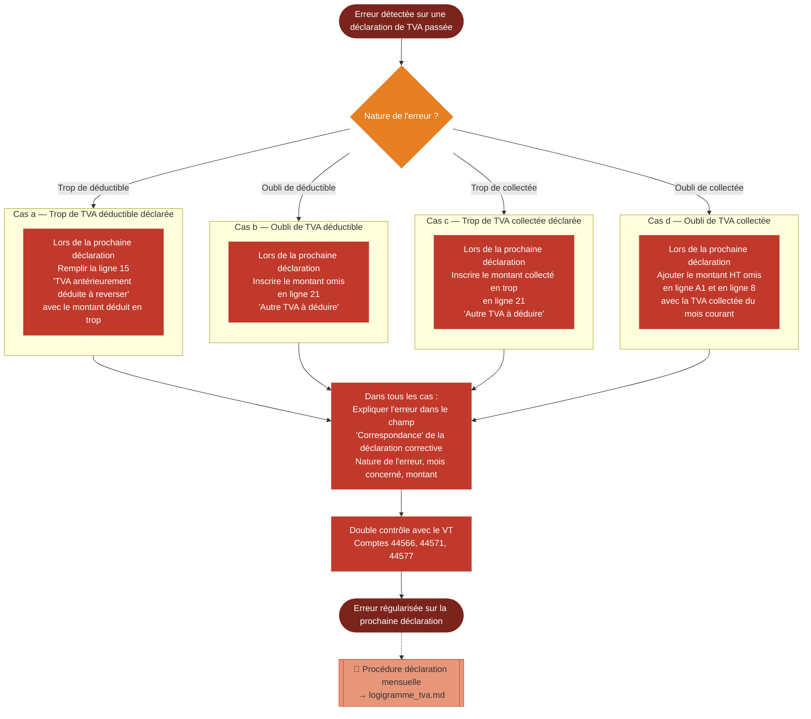

# Logigramme — Rectification d'une déclaration de TVA

> Fiche associée : [tva_rectification.md](../tva_rectification.md)

## ⚠️ Points sensibles

- La correction se fait toujours sur la déclaration du mois suivant — il n'y a pas de déclaration rectificative séparée
- Toujours remplir le champ correspondance — un écart inexpliqué peut poser problème lors d'un contrôle fiscal
- Les cas b et c utilisent tous les deux la ligne 21, mais dans des sens opposés — bien vérifier la cohérence de la case 28 après correction
- Ne pas attendre plusieurs mois pour régulariser une erreur identifiée

## ❓ Précisions

- Le champ correspondance sert à deux fins : tracer le contexte pour le trésorier lui-même (notamment pour expliquer l'écart lors d'un audit) et informer l'administration fiscale
- Exemple de formulation : "Régularisation d'une TVA déductible omise sur la déclaration de MM-AAAA : facture ACH-XXX non incluse, montant de TVA concerné : XX,XX €"
